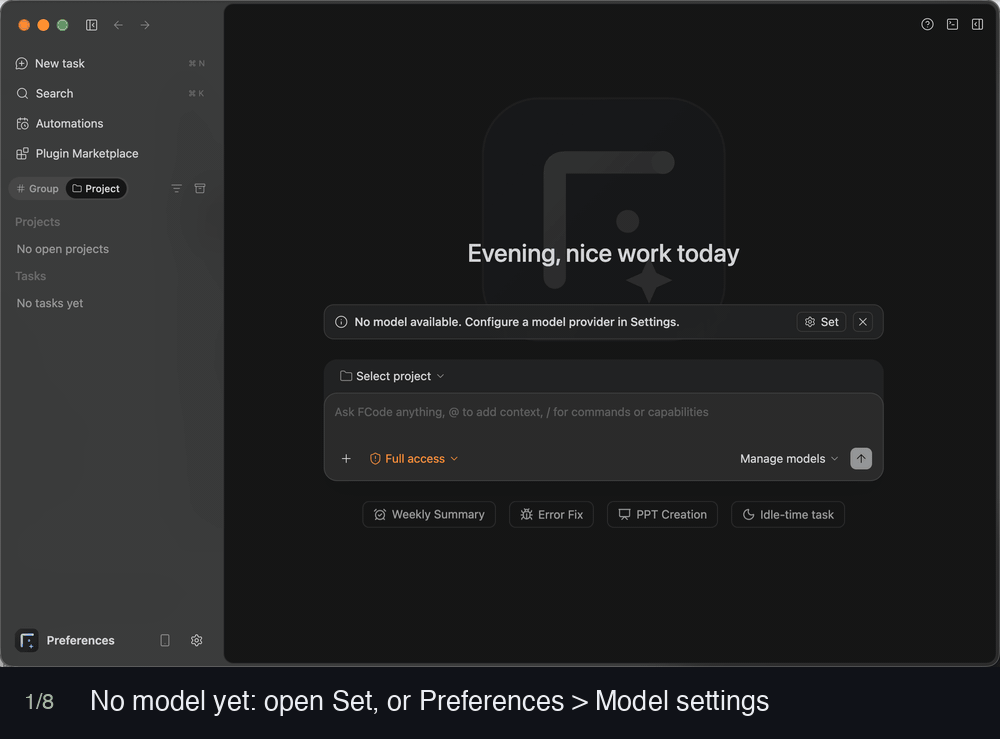
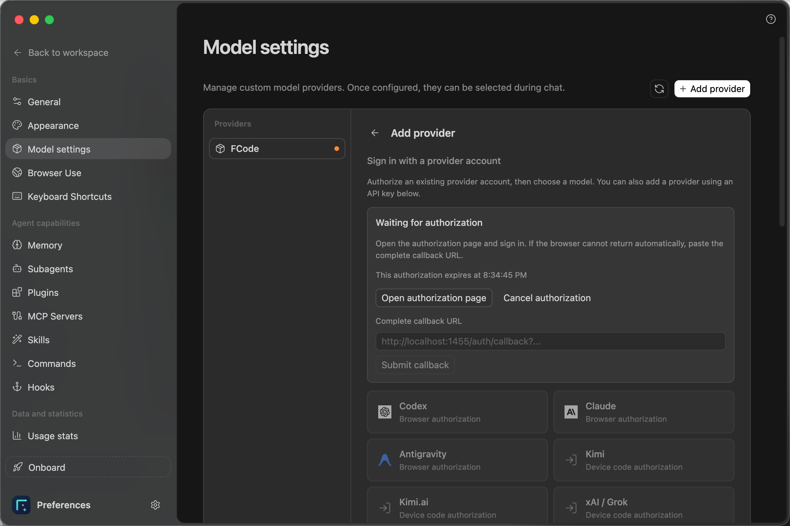
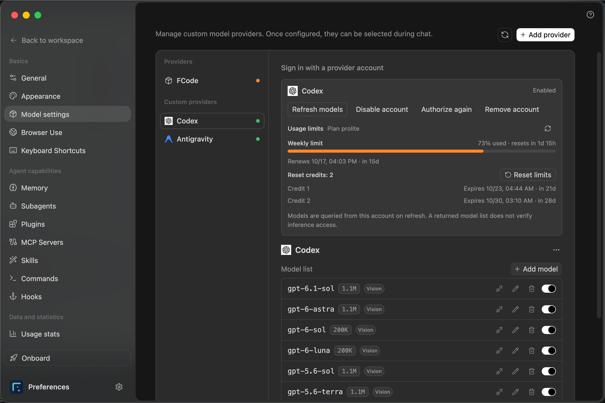
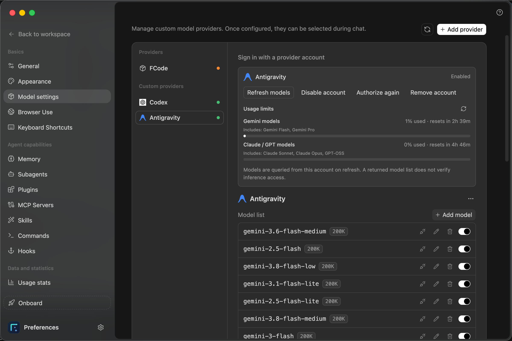
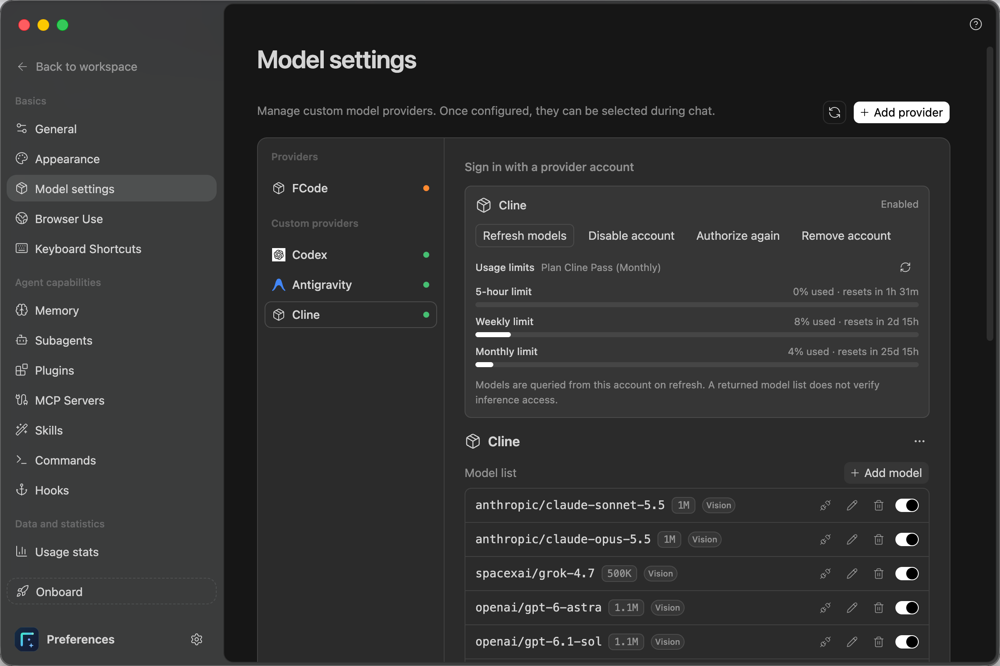
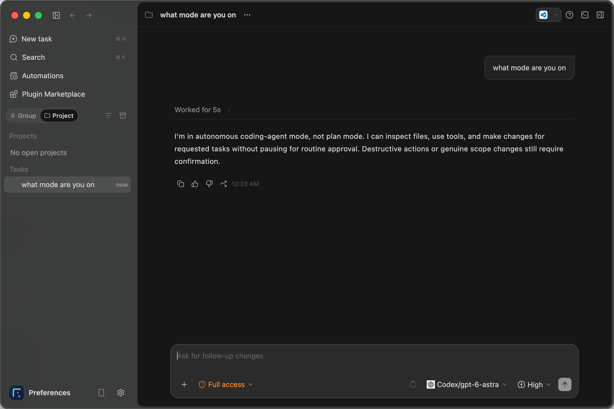
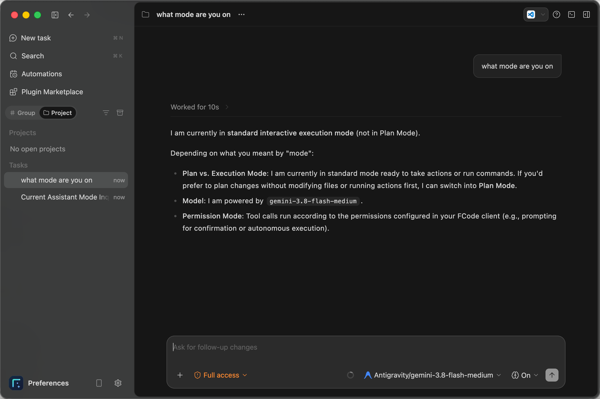
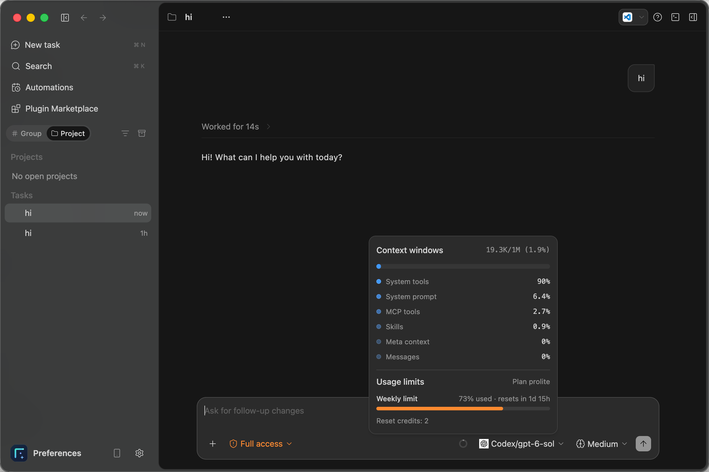

<p align="center">
  
</p>
<p align="center">用 Codex 等账号 OAuth 直接登录的桌面 AI 编程助手</p>
<p align="center">
  <a href="https://github.com/markusleevip/FCode/releases"></a>
  <a href="LICENSE"></a>
</p>
<p align="center">简体中文 | <a href="README.en.md">English</a></p>

FCode 是一款桌面 AI 助手，支持用 Codex 等账号通过 OAuth 直接授权登录，无需 API key。安装后在模型设置中授权账号，选择模型即可开始对话或处理本地项目。

## 亮点：账号 OAuth 直接登录

不用再申请、复制和保管 API key——在 FCode 里点一下，用浏览器登录你已有的账号，授权完成后直接在对话框里使用该账号可用的模型：



- **Codex、Antigravity 一键授权**：添加供应商时选择账号，浏览器登录授权即可，授权后自动获取模型列表，一键启用要用的模型。
- **Cline 设备码授权**：支持 Cline 账号登录，按提示在浏览器中确认设备码即可，无需复制 API key；授权后同样自动获取模型列表，部分模型会带有 **Free** 标记（由 Cline 免费提供）。
- **多种账号统一接入**：除 Codex、Antigravity、Cline 外，还可选择 Anthropic / Claude（浏览器授权），以及 Kimi、Kimi.ai、xAI / Grok（设备码授权）。以应用内“添加供应商”页面显示的列表为准。
- **订阅套餐用量一目了然**：Codex、Antigravity 和 Cline 账号可在模型设置和对话输入框中查看套餐用量、已用百分比与重置时间，详见下文“查看订阅套餐用量”。
- **回调失败也能完成**：浏览器未能自动回调时，把完整回调地址粘贴回 FCode 即可提交，不必重新来过。
- **模型来自账号本身**：模型列表按账号实际返回刷新，不是写死的预设；授权过期时在界面里点击“重新授权”即可。
- 同时仍保留 FCode 供应商和自带 API key 两种方式，按需选择。

各账号实际能用哪些模型，取决于对应服务返回的权限，请以刷新后的模型列表和一次真实对话为准。

## 下载

安装包发布在 [Releases 页面](https://github.com/markusleevip/FCode/releases/latest)，源码仓库本身不包含任何二进制安装包。

| 平台 | 安装包 |
| --- | --- |
| macOS（Apple 芯片 M 系列，arm64） | `.dmg` |
| Windows x64 | `.exe` 安装程序 |

macOS 安装包仅适用于搭载 M 系列芯片（M1、M2、M3、M4 等）的 Mac，不支持 Intel 芯片的 Mac；Intel Mac 暂未提供安装包，可尝试从源码构建（`package.sh x64`，我们尚未验证）。

每个安装包旁附有同名 `.sha256` 校验文件，下载后建议核对。

## 功能

- 在桌面窗口中与 AI 对话，选择项目目录后处理本地代码。
- 账号 OAuth 授权登录（Codex、Antigravity、Cline 等），也支持 FCode 供应商和自带 API key。
- 在应用内查看 Codex、Antigravity 和 Cline 账号的订阅套餐用量。
- 支持插件、MCP、技能、子代理与工作流。
- 内置浏览器，可用于查看和操作网页。
- 工作区、会话与设置保存在本机。

## 快速开始：连接 Codex 或 Antigravity

以下图文演示如何在 FCode 内通过账号授权登录 Codex 和 Antigravity，并直接与配置好的模型对话。截图来自 macOS，Windows 的窗口外观可能不同；界面语言不同会影响按钮文字，下文同时给出截图中的英文名称。

### 1. 安装 FCode

按上方“下载”表格获取对应平台的安装包并安装，然后启动 FCode。macOS 当前打包流程默认不签名、不公证，系统可能阻止打开，请只使用本项目 Releases 页面提供的安装包。没有对应平台的安装包时，请按下方“从源码构建”自行编译；使用安装包无需安装 Node.js、pnpm，也无需执行任何编译命令。

连接账号前，请准备可用的 Codex 或 Antigravity 账号，并确保能在浏览器中打开授权页面。账号的实际模型权限以服务返回结果和实际对话为准。

### 2. 打开模型设置

首次启动如果出现“欢迎来到 FCode”，点击 **暂时跳过** 进入主界面。主界面可能显示 **No model available. Configure a model provider in Settings.**（没有可用模型，请在设置中配置模型供应商），这表示尚未配置可用模型。点击提示右侧的 **Set**，或从左下角 **Preferences（偏好设置）** 进入 **Model settings（模型设置）**。

### 3. 添加供应商并授权账号

在模型设置中点击右上角 **Add provider（添加供应商）**，在 **Sign in with a provider account（使用供应商账号登录）** 下选择 **Codex** 或 **Antigravity**（均为 **Browser authorization，浏览器授权**）。选择后应用会显示 **Waiting for authorization（等待完成授权）**。

1. 如果浏览器未自动打开，点击 **Open authorization page（打开授权页面）**。
2. 在浏览器中登录你要使用的账号，并按页面提示完成授权。
3. 返回 FCode，等待授权结果更新。
4. 如果浏览器未能自动完成回调，将浏览器地址栏中最终的**完整回调地址**粘贴到 **Complete callback URL（完整回调地址）**，然后点击 **Submit callback（提交回调）**。截图中的 `http://localhost:1455/auth/callback?...` 只是格式提示，请使用本次授权产生的真实地址，包含完整查询参数。

如果授权过期，请重新开始授权；如果提示回调端口被占用，关闭其他正在进行授权的应用后重试。完整回调地址可能包含临时授权信息，请仅粘贴到本机 FCode 的回调输入框。同一页面还提供 Claude（浏览器授权）以及 Kimi、Kimi.ai、xAI / Grok、Cline（设备码授权），按页面提示完成即可。

**Cline 使用设备码授权**：选择 **Cline** 后，按应用中的提示打开授权页面，在浏览器中登录 Cline 账号并确认应用显示的设备码，返回 FCode 等待授权结果更新即可，不需要提交回调地址。



### 4. 确认授权成功并启用模型

授权完成后，左侧 **Custom providers（自定义供应商）** 下会出现对应的账号。选择它，确认状态为 **Enabled（已启用）**；如果模型列表为空或需要更新，点击 **Refresh models（刷新模型）**，并打开要使用的模型右侧开关。账号卡片中的 **Usage limits（用量限额）** 会同时显示订阅套餐用量，详见下文“6. 查看订阅套餐用量”。

| Codex | Antigravity |
| --- | --- |
|  |  |



截图展示了这几个账号返回的模型列表。模型名称和数量可能随账号及服务变化，请以你实际刷新得到的列表为准。**获取到模型列表不代表已经验证对话调用权限**，需要继续发送一次消息确认。

### 5. 选择模型，直接对话

点击 **Back to workspace（返回工作区）**，通过 **New task（新建任务）** 开始对话，在输入框右下方的模型选择菜单中选择 **Codex/模型名称**、**Antigravity/模型名称** 或 **Cline/模型名称**，直接发送消息即可。

先发送一条简单消息，例如“你好，请简短介绍你能帮我做什么”。收到正常回复后，再开始实际任务。处理本地代码时，通过 **Select project（选择项目）** 选择项目目录，并描述具体需求，例如：“请先阅读项目结构，说明如何启动这个项目。”

截图中的 **Full access（完全访问）** 是权限选项；开始处理项目之前，请在该菜单中选择符合你需求的权限范围。

| Codex | Antigravity |
| --- | --- |
|  |  |

### 6. 查看订阅套餐用量

Codex、Antigravity 和 Cline 账号授权并启用后，可以在两处查看订阅套餐的用量：

- **模型设置**：在对应账号卡片的 **Usage limits（用量限额）** 区块查看（见上文第 4 步的截图），点击右侧刷新按钮可更新。Codex 显示套餐、周限额（Weekly limit）已用百分比、重置倒计时和续期时间，并显示 **Reset credits（重置额度）** 数量及各额度的到期时间；Antigravity 按模型组分别显示（如 Gemini models、Claude / GPT models）的已用百分比和重置倒计时；Cline 显示套餐（如 Cline Pass）以及 5 小时、每周、每月三档限额的已用百分比和重置倒计时。
- **对话输入框**：将鼠标悬停在模型选择器左侧的用量圆环上，会弹出浮层：上半部分是当前对话的上下文窗口（Context windows）占用，下半部分是当前模型所属账号的用量限额，无需离开对话界面。



注意：

- 用量数据来自账号对应服务的返回结果，不同账号和套餐显示的项目不同；截图中的套餐、百分比和模型名称仅为示例，请以你的账号实际显示为准。Cline 账号的套餐和限额档位同样以应用内显示为准。
- Codex 账号的 **Reset limits（重置限额）** 会消耗一个重置额度，点击前请确认确实需要重置；没有重置额度的账号不会显示该选项。
- 用量没有显示或长时间未更新时，点击刷新按钮；仍然失败时，检查网络，必要时点击 **Authorize again（重新授权）**。

### 常见问题

| 现象 | 处理方法 |
| --- | --- |
| 仍显示没有可用模型 | 检查 Codex 账号是否已启用、模型开关是否打开，再回到对话界面选择模型。 |
| 一直等待授权 | 在浏览器中完成登录；未自动回调时提交本次授权的完整回调地址，过期后重新授权。 |
| 账号已连接，但模型列表获取失败 | 选中 Codex 后重新点击“刷新模型”；仅模型列表获取失败时，无需重新登录。 |
| 模型已显示，但发送消息失败 | 查看实际错误提示，检查网络和账号的模型权限；提示需要重新授权时点击 **Authorize again（重新授权）**。 |

## 从源码构建

使用 `apps/desktop` 下的三个脚本完成：**编译（Build）→ 运行（Run）→ 打包（Package）**。以下命令均从仓库根目录执行。

### 环境要求

| 平台 | 需要准备 |
| --- | --- |
| macOS | Node.js 与 pnpm（版本见 `apps/desktop/mise.toml`）、Xcode Command Line Tools（`xcode-select --install`） |
| Windows x64 | Node.js 24.x，并加入 `PATH`（脚本会自动检测）；pnpm 10.x 可选，`PATH` 中没有 pnpm 时脚本会通过 Node 自带的 corepack 自动启用（首次需要联网下载）；如果工具装在固定目录而不在 `PATH` 中，可设置环境变量 `FCODE_TOOLCHAIN`，或在 `apps/desktop` 下新建不入库的 `toolchain.local.cmd` 写入 `set "FCODE_TOOLCHAIN=你的目录"`（目录下需有 `node24\node-v24.14.0-win-x64` 和 `pnpm\node_modules\.bin`） |

首次编译会自动执行 `pnpm install --frozen-lockfile` 安装依赖，无需手动安装。

### macOS

```bash
# 1. 编译
./apps/desktop/build.sh

# 2. 运行（开发模式启动桌面端，退出按 Ctrl+C）
./apps/desktop/run.sh

# 3. 打包（生成 .dmg，默认与本机架构一致）
./apps/desktop/package.sh
```

常用选项：

```bash
./apps/desktop/build.sh --release    # 编译后继续打包，等价于依次执行 build.sh 和 package.sh
./apps/desktop/package.sh arm64      # 指定架构，可选 arm64 或 x64
FCODE_ENABLE_MAC_SIGN=1 ./apps/desktop/package.sh   # 提供签名证书时才签名，默认产出未签名安装包
```

### Windows

```powershell
# 1. 编译
.\apps\desktop\build.cmd

# 2. 运行（开发模式启动桌面端，退出按 Ctrl+C）
.\apps\desktop\run.cmd

# 3. 打包（生成 .exe 安装包，仅支持 x64）
.\apps\desktop\package.cmd
```

常用选项：

```powershell
.\apps\desktop\build.cmd --release   # 编译后继续打包
```

也可以在 `apps/desktop` 目录中双击对应脚本。

### 运行说明

- 第一次使用请先编译，再运行；缺少依赖时 Run 会提示先执行 Build。
- Run 使用隔离的本地数据目录，不会修改你主目录下已有的 FCode 数据（缺少本地设置时仅只读导入一次），无需手动设置环境变量。
- Run 需要本机 5174 端口空闲；端口被占用时请先关闭之前启动的实例。
- 运行时保持终端打开，退出时按 `Ctrl+C`。

### 安装包输出位置

- Windows：`releases/windows/<版本号>/`，生成 `.exe` 安装包。
- macOS：`releases/macos/<版本号>/`，生成 `.dmg` 并附 `.sha256` 校验文件（构建时还会附带一个 `.zip`，仅供本地使用，不对外发布）。

这些目录是本地构建产物，已被 `.gitignore` 忽略，不会提交到仓库；对外发布的安装包统一上传到 [GitHub Releases](https://github.com/markusleevip/FCode/releases)。

## 反馈与贡献

使用中遇到问题或有改进建议，欢迎在 [Issues](https://github.com/markusleevip/FCode/issues) 中反馈，也欢迎提交 Pull Request。

## 致谢与来源

FCode 在设计与实现上参考了 ZCode 项目，在此向 ZCode 项目及其贡献者致谢。
本项目为独立维护的项目，与 ZCode 项目及其所属公司没有隶属或官方合作关系；“ZCode”“z.ai”等名称和标识归其各自权利人所有。
第三方组件及其许可证见 [apps/desktop/THIRD-PARTY-NOTICES.md](apps/desktop/THIRD-PARTY-NOTICES.md)。

## 许可证

本项目依照 [Apache License 2.0](LICENSE) 开源。
